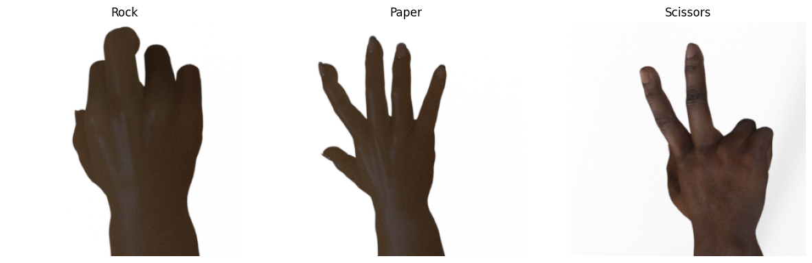
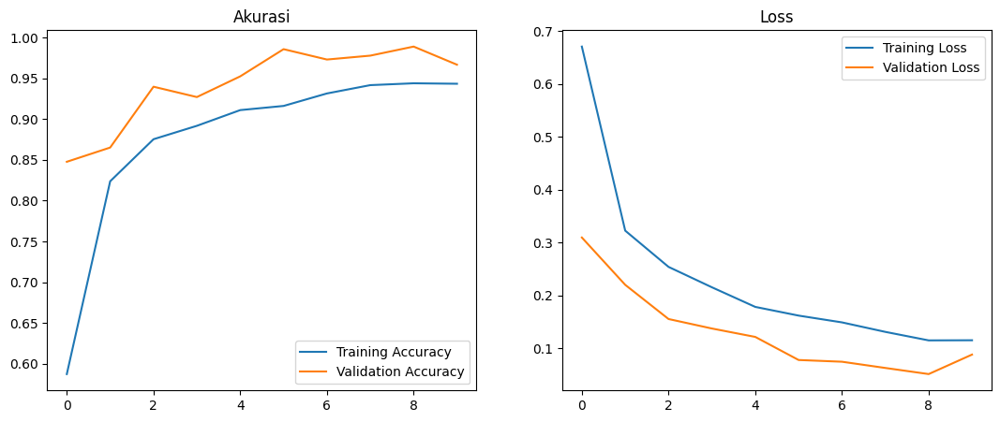

# Modul-6-MachineLearning-WebDeploy

## _Dataset_
Dataset yang digunakan dalam tugas ini menggunakan data citra yang berisi : 
- rock
- paper
- scissors
  

Splitting dataset: 70% train, 5% test & 25% validation

## _MODEL_
Menggunakan Model RestNet101, melakukan Image Generator dengan melakukan 10 epoch
- Grafik loss dan accuracy pada Model yang sudah terhubung dengan ResNet101
  

## _RestNet 101_
ResNet-101 adalah salah satu arsitektur dalam keluarga ResNet (Residual Networks), yang merupakan salah satu model vertikal mendalam yang sangat sukses dalam tugas pengenalan gambar

## _Akurasi_
akurasi yang di dapatkan adalah
- Accuracy: 96.67%
- Loss: 0.08820656687021255
